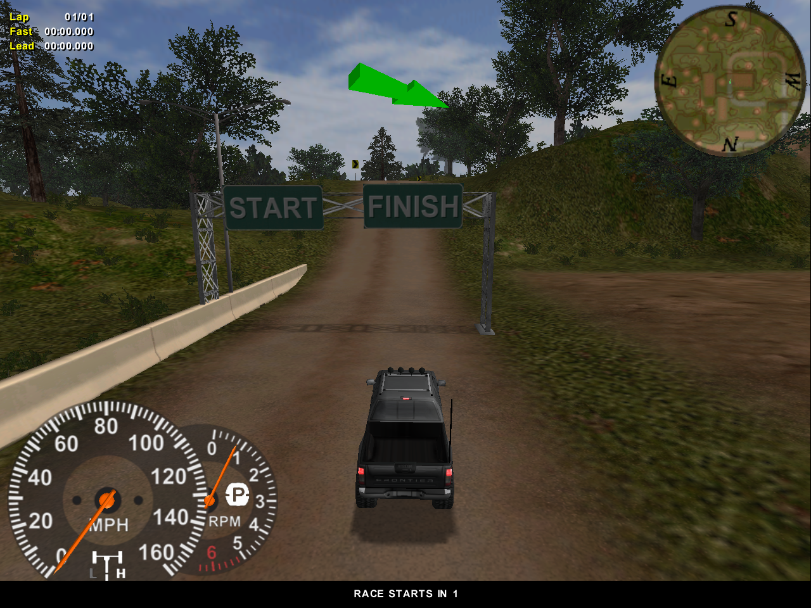
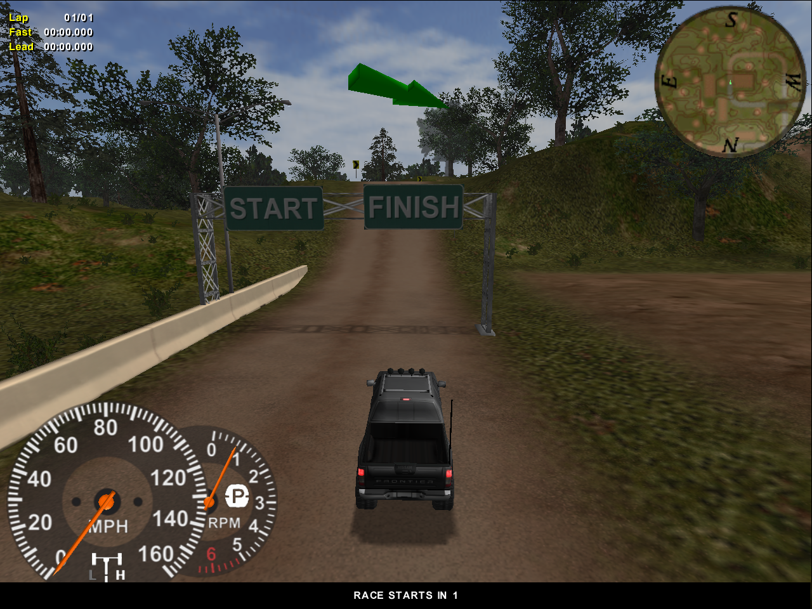

# 4x4e2

## Project
4x4e2 is an open source implementation of Terminal Reality's [4x4 Evolution 2](https://en.wikipedia.org/wiki/4x4_Evo_2) Build 139 from early 2000s.

## Goals
There are multiple goals this project tries to achieve:
1. Learn how games were made in an era when things had to be done in the code, and not through fancy game engines like today.
2. Have a fully playable game implemented end-to-end, including resource management, audio, and video rendering, as well as support of large screen resolutions.
3. Eventually, to support 64-bit compilation for modern systems, and provide an avenue for development of modern renderer implementations such as DirectX or Vulkan.
4. Also, eventually, to support modern input devices that do not comply with DirectInput, and even port to Linux or Mac.

## Requirements & Dependencies
1. [Microsoft Visual Studio](https://visualstudio.microsoft.com/downloads/)
2. [Microsoft DirectX 8.0a SDK](https://archive.org/details/dx8a_sdk)
3. [Microsoft DirectX 9.0 SDK (June 2010)](https://www.microsoft.com/en-US/download/details.aspx?id=6812) 

## Screen Shots
### DirectX 8.0

### DirectX 8.0 T&L

### OpenGL 1.1

### DirectX 9.0

### DirectX 9.0 T&L

DirectX 9.0 renderers are upgrades to the DirectX 8.0 renderers. These renderers are an important step towards the future 64-bit compatibility.

## Notes
1. The original game was compiled by Watcom C/C++ compiler, it contains the following sting: `WATCOM C/C++32 Run-Time system. (c) Copyright by WATCOM International Corp. 1988-1995. All rights reserved.`. The game and the modules use cdecl calling convention.
3. The DirectX 8.0 T&L renderer has the original shaders, as they come with the game. They contains debug information, thus, if you compile disassembled shaders, you will get way smaller payloads.

## Thanks
1. Thanks to [My Abandonware](https://www.myabandonware.com/) for providing [4x4 Evo 2](https://www.myabandonware.com/game/4x4-evo-2-a6c).
2. Thanks to [d3d8to9](https://github.com/crosire/d3d8to9) for the insights and the details for the upgrade to DirectX 9.0 above and beyond what Microsoft's article [Converting to Direct3D 9](https://learn.microsoft.com/en-us/windows/win32/direct3d9/converting-to-directx-9) provides.

## Legal
1. This is not a complete game. Please purchase software you like!
2. The source code in this repository is mostly produced by reverse engineering the original binaries. There are a couple of exceptions for reverse engineering under DMCA -- documentation, interoperability, fair use. See goals section for the interoperability and fair use cases. The documentation is needed to support those. Also please see an article about [software preservation](https://en.wikipedia.org/wiki/Digital_preservation).
3. 4x4 Evolution, DirectX, OpenGL, Vulkan, and others are trademarks of their respective owners.

